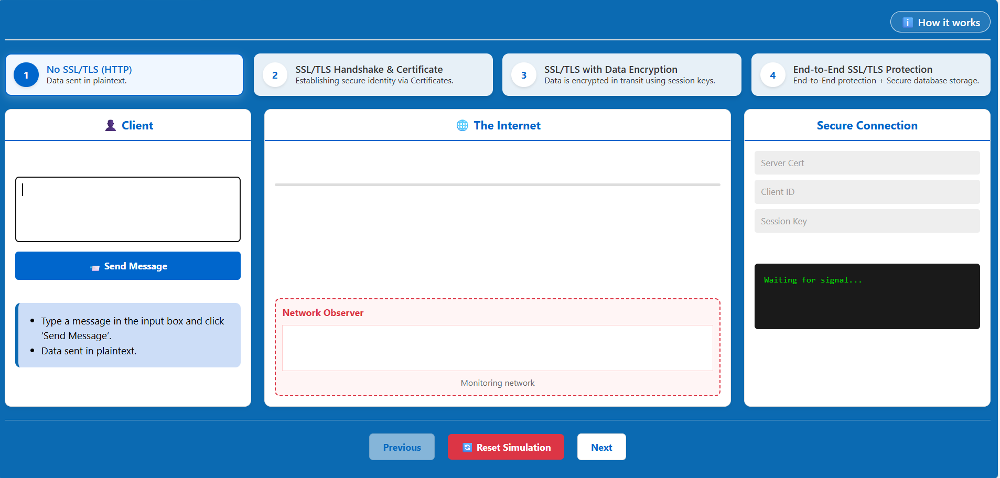
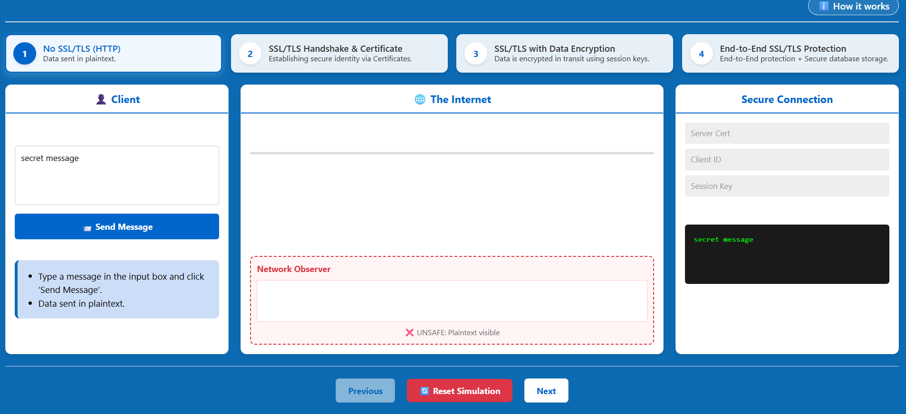
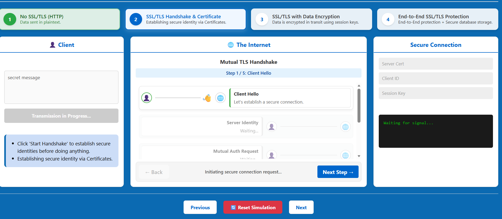
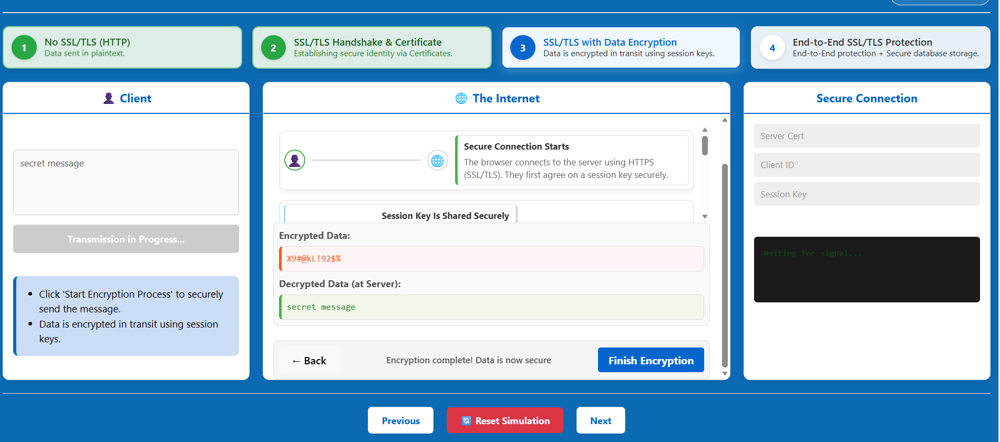
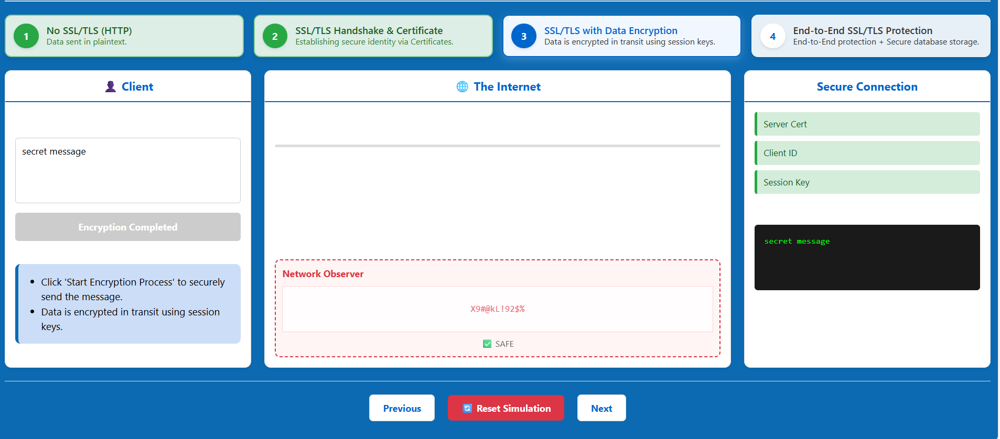
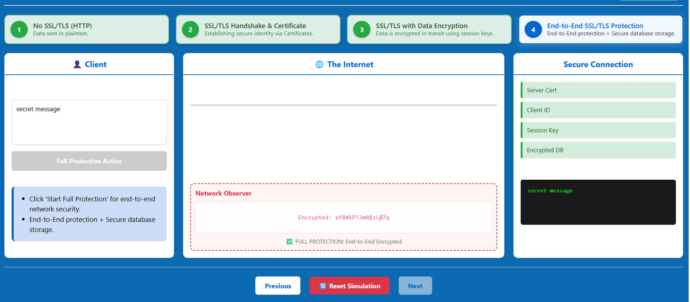

## Stage 1: No SSL/TLS (HTTP)
In this stage, communication between the client and the server occurs over an unencrypted channel.

1.  **Input Message**: In the 'Client' section, type a sample message (e.g., a username or a database query) into the input box.
2.  **Send Message**: Click the **'Send Message'** button.
3.  **Observe Network**: Look at the **'Network Observer'** section in the middle. You will see the message being transmitted in **plaintext**.

4.  **Result**: An eavesdropper monitoring the network can easily read the sensitive data being transmitted.

## Stage 2: SSL/TLS Handshake & Certificate
This stage demonstrates the process of establishing a secure connection.

1.  **Initiate Next Stage**: Click the **'Next'** button to move to the Handshake phase.
2.  **Observe Handshake**: Watch the simulation as the client and server exchange certificates.
3.  **Authentication**: The server presents its **Digital Certificate** to prove its identity to the client.
4.  **Identity Verification**: Observe the 'Secure Connection' panel on the right, which will display the **Server Cert** and **Client ID** once verified.

## Stage 3: SSL/TLS with Data Encryption
Once the identity is verified, a secure session is established.

1.  **Click Next**: Move to the Data Encryption stage.
2.  **Key Exchange**: Observe how the client and server agree on a **Session Key**.
3.  **Encrypted Transmission**: Type another message and click 'Send Message'.
4.  **Observe Network**: Check the 'Network Observer'. The data will now appear as **Ciphertext** (unreadable "garbage" text).

5.  **Decryption**: The server uses the shared session key to decrypt and read the message.

## Stage 4: End-to-End SSL/TLS Protection
The final stage ensures security across the entire ecosystem.

1.  **Click Next**: Proceed to the final stage.
2.  **End-to-End Protection**: Observe that the connection is now secure from the Client to the Internet, and finally to the Database.

 
 You can use the **'Reset Simulation'** button at any time to return to the first stage and observe the differences again.
